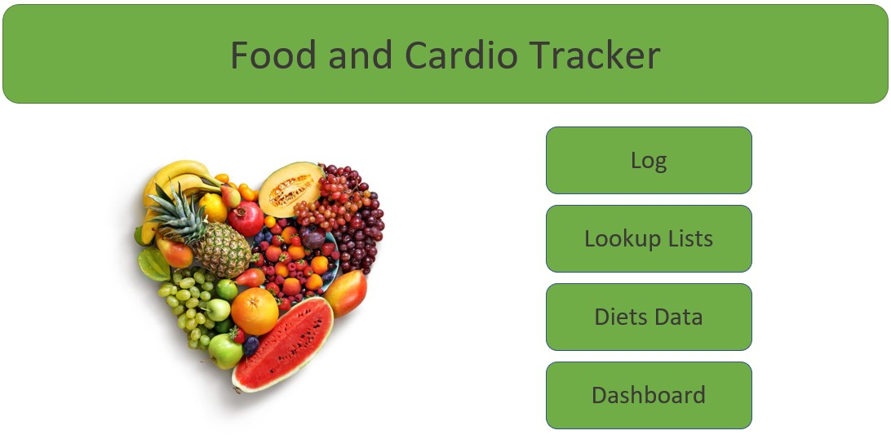
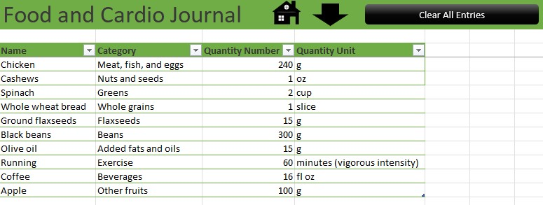
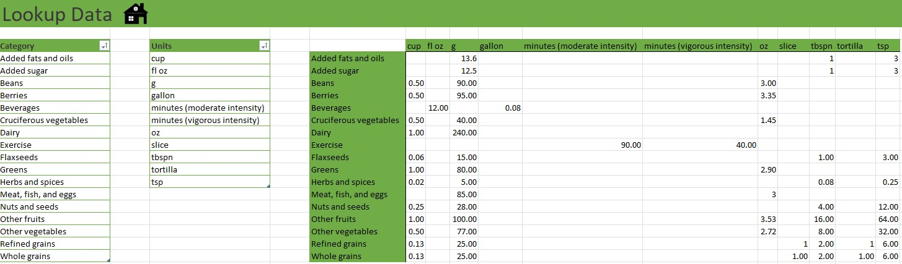
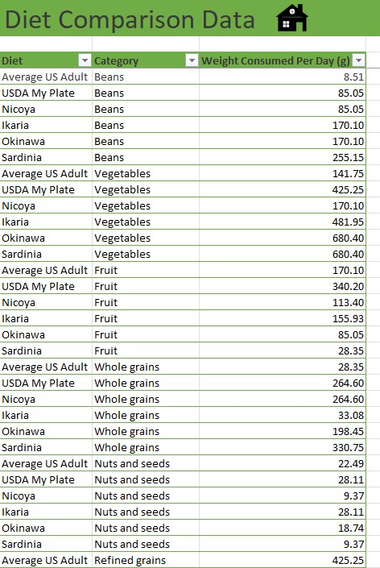
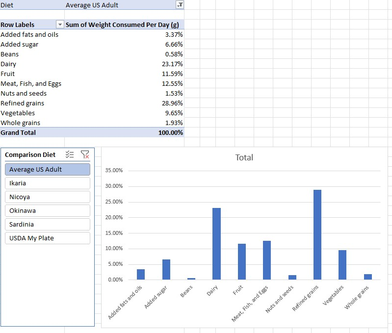
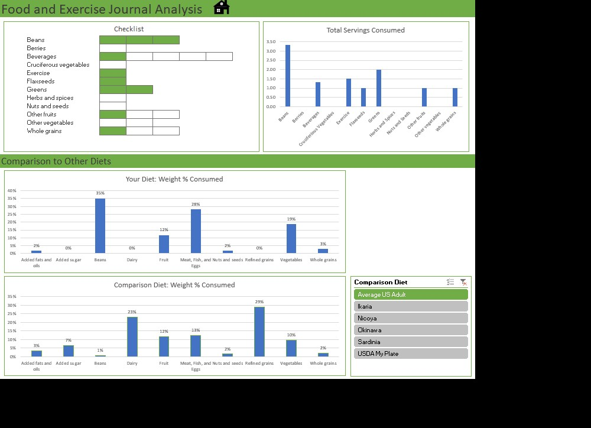

# excel-food-cardio-tracker

This repository is for the Excel Food and Cardio Tracker Worksheet based on Dr. Michael Greger's [Daily Dozen Checklist](https://nutritionfacts.org/video/dr-gregers-daily-dozen-checklist/) and the dietary habits found in the [Blue Zones](https://www.bluezones.com/). Below you will find an overview of the data collection, data cleaning, and creation of the Excel Worksheet. I created this project to help me eat healthier and to compare how I was eating to the Blue Zones, [USDA MyPlate](https://www.myplate.gov/), and [standard American diet](https://pubmed.ncbi.nlm.nih.gov/21139124/).

## Files

### food_and_cardio_tracker.xlsm

This Microsoft Excel Macro-Enabled Worksheet contains six sheets: Home, Log, Lookup, Diets_Data, Pivot_Diets, and Dashboard. The Home sheet contains buttons linked to the four main sheets (Log, Lookup Lists, Diets Data, and Dashboard). The Log sheet contains a data table where the user can enter in what they have eaten. The Lookup sheet contains tables and data for lookup functions used in the Dashboard sheet. The Diets_Data sheet contains the data collected about the diets of the average US adult, blue zones (Ikaria, Nicoya, Okinawa, and Sardinia), and USDA MyPlate. The Pivot_Diets sheet contains a pivot table and pivot chart created from the data in the Diets_Data sheet. The Dashboard contains a checklist and charts using the user entered data in the Log sheet and diet data from the Diets_Data sheet.

## Data Collection

The data in the Diets_Data sheet was collected from [Mona S. Ottum's Essential Balance Nutrition website](http://www.monaottum.com/2017/05/17/nicoya-costa-rica-a-puzzling-blue-zone-diet-light-on-vegetables-and-high-in-carbohydrate-and-sugar/).

## Data Cleaning

The data found on the page linked about was transformed into the format found on the Diets_Data page (from a lookup table to a table with Diet, Category, and Weight Consumed Per Day (g)). The units used in the table (ounces, teaspoons, and tablespoons) were converted to grams. The dry weights for whole grains, refined grains, and beans were converted to cooked weights.

## Excel Sheets

### Home

The Home sheet is the first sheet the user sees and provides links to navigate to other sheets in the file.

<figure>
 
  <figcaption>Figure 1: Home sheet with buttons to navigate Excel file.</figcaption>
</figure>

### Log

The Log sheet is where the user enters in their daily food, beverages, and cardio. The top row contains buttons to bring the user back to the Home sheet and to bring the user to the button of the log sheet (if the log sheet becomes too large to fit on the screen). A third button automates clearing all entries of the journal using a macro. The entries into the log restricted by data validation. The food category and unit of measurement can be chosen from the dropdown lists. The quantity must be a decimal. Finally, a hidden column calculates the servings based on a chart in the Lookup sheet. The formula uses INDEX() and MATCH() functions for lookup.

<figure>
 
  <figcaption>Figure 2: Log sheet for entering daily food, cardio, and drinks.</figcaption>
</figure>

### Lookup

The Lookup sheet contains three tables that are refered to by equations on the Log and Dashboard sheets. The lists used for data validation on the Log sheet are the left two tables and the table used to calculate servings is the right table. The top row contains a button to bring the user back to the Home sheet.

<figure>
 
  <figcaption>Figure 3: Lookup sheet for referencing during calculations for Dashboard sheet.</figcaption>
</figure>

### Diets_Data

The Diets_Data sheet contains the data collected about six different diets. The top row contains a button to bring the user back to the Home sheet.

<figure>
 
  <figcaption>Figure 4: Diets_Data sheet which contains the data used to create a pivot chart and table which is displayed on the Dashboard sheet.</figcaption>
</figure>

### Pivot_Diets

The Pivot_Diets sheet contains the pivot table, pivot chart, and slicer generated from the Diets_Data sheet that is included on the Dashboard sheet.

<figure>
 
  <figcaption>Figure 5: Pivot_Data sheet which contains a pivot table and chart using the data from the Diets_Data sheet.</figcaption>
</figure>

### Dashboard

The Dashboard sheet provides the analysis of the user's diet by filling up a checklist (top left) and calculating servings of each item in the checklist and displaying them in a chart (top right). The bottom section is for comparing the user's diet with six other diets. A slicer is used to select the diet of interest. Calculations used for the chart are hidden to the right of the dashboard. These formulas use INDEX(), MATCH(), and VLOOKUP(). A button in the top row allows the user to return to the Home sheet.

<figure>
 
  <figcaption>Figure 6: Dashboard sheet for displaying the checklist, total servings count, and charts for comparing your diet with Blue Zones and US diets.</figcaption>
</figure>

## Resources

1. [Excel Skills for Business Specialization](https://www.coursera.org/specializations/excel)
2. [NutritionFacts.org](https://nutritionfacts.org/video/dr-gregers-daily-dozen-checklist/)
3. [Blue Zones](https://www.bluezones.com/)
4. [Mona S. Ottum's Essential Balance Nutrition](http://www.monaottum.com/)
